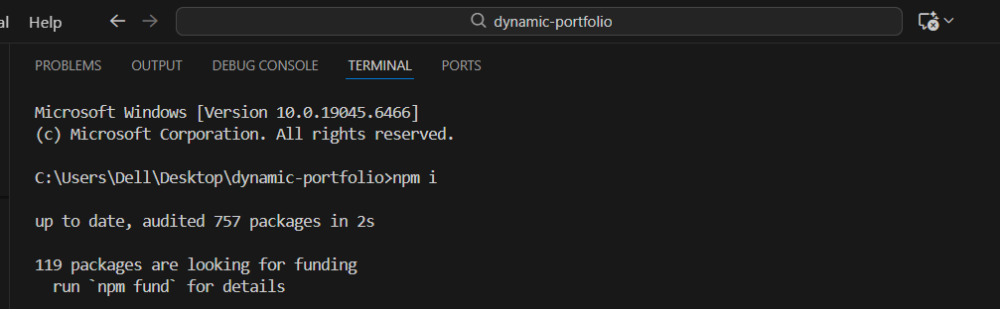
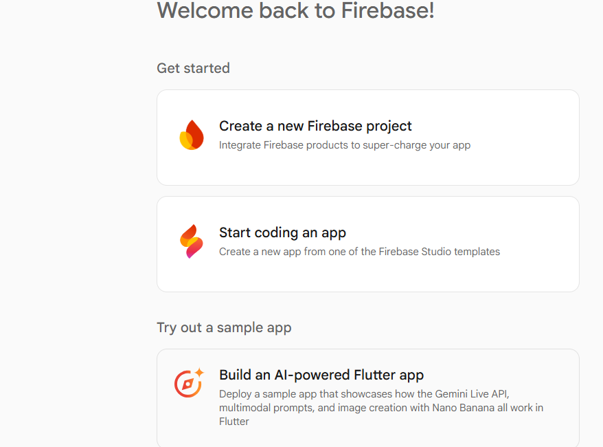
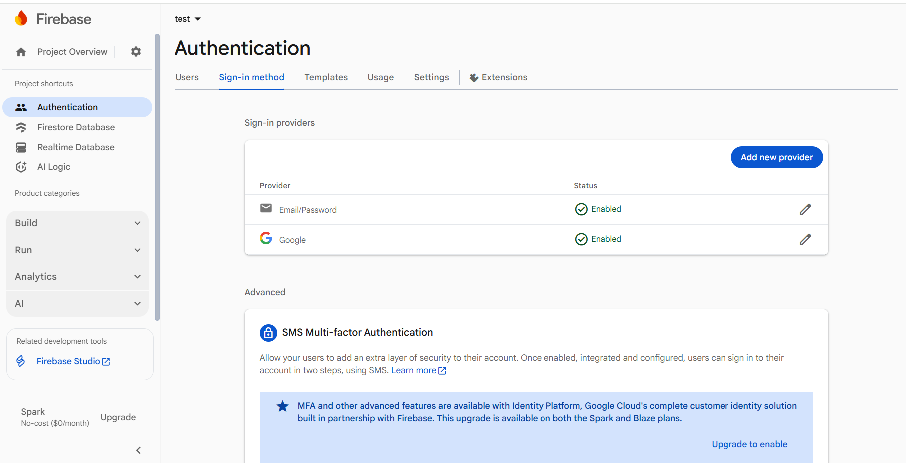
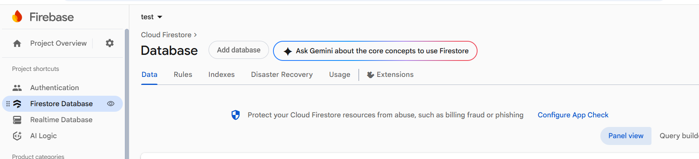
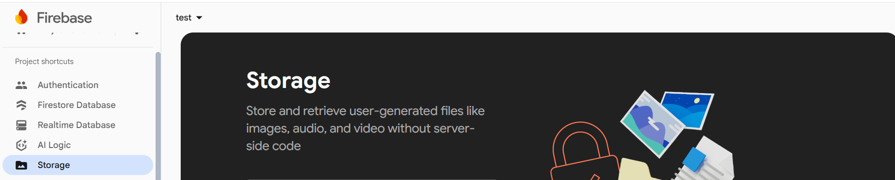
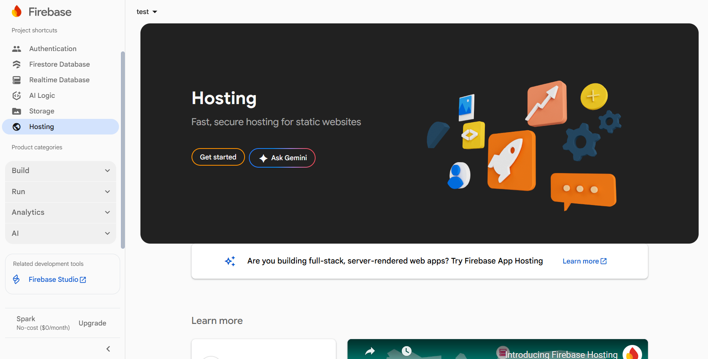
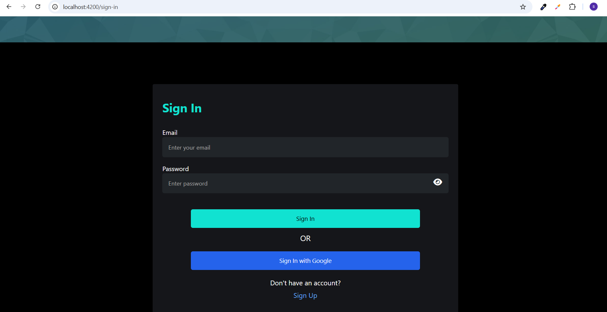
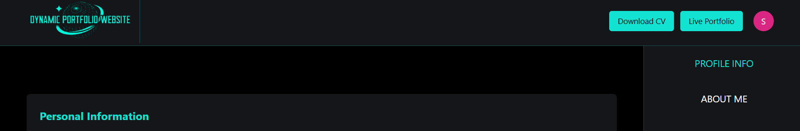

# Dynamic Portfolio – Angular 20 + Firebase  
A fully dynamic personal portfolio builder where users can sign up, fill their information, upload images & CV, manage projects, blogs, services, testimonials, and generate a shareable live portfolio link.

This project is beginner-friendly and includes a complete Admin Dashboard for managing all portfolio content.

---

# Table of Contents
- [Features](#features)
- [Requirements](#requirements)
- [Project Setup](#project-setup)
- [Firebase Setup](#firebase-setup)
- [Configure Environment Files](#configure-environment-files)
- [Run the Project](#run-the-project)
- [Using the Admin Dashboard](#using-the-admin-dashboard)
- [Deploy to Firebase Hosting](#deploy-to-firebase-hosting)
- [Troubleshooting](#troubleshooting)

---

# 🚀 Features

### ✔ User Authentication  
- Firebase Authentication (Email + Password)

### ✔ Admin Dashboard  
Users can log in and manage:
- Personal information  
- About section  
- Projects  
- Blogs  
- Services  
- Testimonials  
- Upload CV  
- Publish a **live portfolio link**  
  - Opens in a new tab  
  - Fully dynamic  
  - Shareable with anyone

### ✔ Firestore Database  
Stores all user data:
- Text content  
- Project info  
- Blog info  
- Services  
- Testimonials  

### ✔ Firebase Storage  
Stores:
- Images  
- User profile picture  
- Projects images  
- Blog images  

---

# 🛠 Requirements

Before starting, please install the following:

### 🔗 Node.js (Latest LTS recommended)  
https://nodejs.org/

### 🔗 Angular CLI  
https://angular.io/cli

To install manually:
```bash
npm install -g @angular/cli
```

### 🔗 Firebase CLI  
https://firebase.google.com/docs/cli

Install it using:
```bash
npm install -g firebase-tools
```

### 🔗 A Google Account  
Required for Firebase Console:  
https://console.firebase.google.com/

---

# 📥 Project Setup

### 1. Install dependencies
```bash
npm install
```

📸 Screenshot Example:  

---

# 🔥 Firebase Setup

Follow these steps carefully. Even beginners can do it.

---

### **1. Go to Firebase Console**
https://console.firebase.google.com/

📸 

---

### **2. Enable Authentication**
Go to:
**Build → Authentication → Get Started**  
Choose **Email/Password** 
Choose **Google** 
📸 

---

### **3. Enable Firestore Database**

Go to:
**Build → Firestore Database → Create Database**

Choose **Production Mode**

📸 

---

### **4. Enable Firebase Storage**
Go to:
**Build → Storage → Get Started**

📸 

---

### **5. Enable Firebase Hosting**
Go to:
**Hosting → Get Started**
📸 

---

### **6. Get Your Firebase Web App Config**
Go to:
**Project Settings → General → Web App**

Copy the config object

---

# ⚙ Configure Environment Files

Open:

```
src/environments/environment.ts
src/environments/environment.prod.ts
```

Paste your Firebase config:

```ts
export const environment = {
  firebase: {
    apiKey: "",
    authDomain: "",
    projectId: "",
    storageBucket: "",
    messagingSenderId: "",
    appId: ""
  },
  production: false
};
```

⚠ Replace empty strings with the real values.

---

# ▶ Run the Project Locally

```bash
ng serve
```

Then open:
👉 **http://localhost:4200**

📸 

---

# 🧑‍💻 Using the Admin Dashboard

After creating your account & logging in, you can:

### ✔ Add Personal Information
- Name  
- Title  
- About Section  
- Profile Image  

### ✔ Add Services  
### ✔ Add Projects  
### ✔ Add Blogs  
### ✔ Add Testimonials  
### ✔ Upload CV  
### ✔ Publish Your Live Portfolio

After publishing, a button appears:

**View Live Portfolio**

Click it to open:
- Your personal website  
- With all dynamic content  
- Shareable with anyone  

📸 Add examples:  
-   
-   
-     
-   

---

# 🌐 Deploy to Firebase Hosting

### 1. Login to Firebase
```bash
firebase login
```

### 2. Initialize Firebase
```bash
firebase init
```

Select:
- Hosting  
- Your Firebase Project  
- Public folder: `dist/dynamic-portfolio`  
- SPA: Yes  

---

### 3. Build Angular Project
```bash
ng build
```

### 4. Deploy
```bash
firebase deploy
```

Your public URL will appear like:
```
https://your-portfolio.web.app
```

---

# ❗ Troubleshooting

### 🔴 Project not loading?  
Check your environment.ts config.

### 🔴 Images not appearing?  
Check Firebase Storage Rules.

### 🔴 Login not working?  
Enable Email/Password authentication.

### 🔴 Using a custom domain (Vercel, Netlify, etc.)? Login still not working?

If you deployed the project on any custom domain other than Firebase Hosting, you must add that domain to Firebase Authorized Domains.

Follow these steps:

1. Go to **Firebase Console**  
2. Open **Authentication**  
3. Click **Settings** (⚙️ icon at the top right)  
4. Scroll to **Authorized domains**  
5. Click **Add domain**  
6. Add your new domain  

**Examples:**
- `yourname.vercel.app`  
- `yourdomain.com`  
- `netlify.app`  

⚠️ If the domain is not added, Firebase Authentication will block login requests and show errors like:  
- **“This domain is not authorized”**  
- **“auth/unauthorized-domain”**

### 🔴 Deploy failing?  
Run:
```bash
firebase login
firebase logout
firebase login
```

---

Thank you for using **Dynamic Portfolio 🚀**
